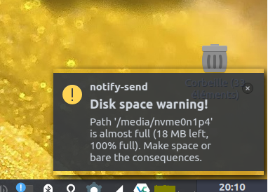

# Ubuntu free space warning

**A simple notification showing partitions potentially running out of space**

Copyright © 2020 Andrew Jackson (https://github.com/ceever ... ceever@web.de)

 This program is free software; you can redistribute it and/or modify
 it under the terms of the GNU General Public License as published by
 the Free Software Foundation; either version 2 of the License, or
 (at your option) any later version.

 This program is distributed in the hope that it will be useful,
 but WITHOUT ANY WARRANTY; without even the implied warranty of
 MERCHANTABILITY or FITNESS FOR A PARTICULAR PURPOSE.  See the
 GNU General Public License for more details.

 You should have received a copy of the GNU General Public License
 along with this program; if not, write to the Free Software
 Foundation, Inc., 51 Franklin Street, Fifth Floor, Boston MA 02110-1301, USA.
 
 ---

Since this topic bugged me for a while and I usually are very moderate giving space to my operating system, especially when running from a small portable drive, I needed something that told me, in case my system partition was full.

The script can probably be improved, allowing exceptions and further things. If you drop me a message and state your specific requirement, I can adjust it if needed.

---
**BUGS & REQUESTS:**

Send me an email or open a ticket on github.

---
**INSTALLATION:**
* Drop the *space_check.sh* wherever you like and where it does not bother you, but you still remember ... maybe ~/.local/bin/
* Add the script location to the autostart setting of your specific distribution, e.g. https://askubuntu.com/questions/1086/how-to-make-program-autostart-only-in-gnome or https://itsfoss.com/manage-startup-applications-ubuntu/, https://medium.com/@jsakov/linux-start-an-application-automatically-at-boot-2b6fb61524d7, or https://www.fosslinux.com/500/how-to-add-auto-startup-applications-in-ubuntu-16-04.htm
* You can modify the trigger that causes the notification, currently at "< 100 MB AND > 98 %" ... see script, or drop me a message.
* Dependency: *notify-send* ... thus:
<pre>sudo apt install libnotify-bin</pre>
